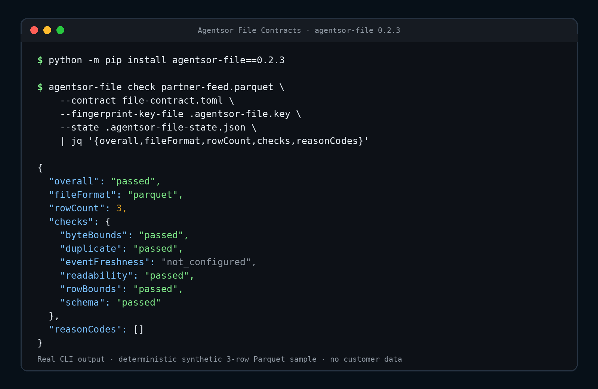

# Agentsor File Contracts

**Validate a downloaded partner CSV or Parquet feed locally after your existing
SFTP, S3, or export job, then get a hosted alert when its rolling receipt
deadline is missed.**

Agentsor File Contracts is a free, MIT-licensed command-line tool for checking
one completed local CSV or Parquet file against an explicit TOML contract. It
runs after the existing pickup or export job exposes the final file; it is not
an SFTP client, storage connector, or directory watcher. It checks:

- file readability;
- required columns and Arrow types;
- unexpected columns;
- row and byte bounds;
- optional event-time freshness; and
- optional duplicate history.

`init`, `check`, and `schema` run offline. The separate `report` command checks
the file locally and sends only the fixed redacted result envelope to the
single Agentsor collector. The package has no file-upload or telemetry path.

[Follow the daily partner-feed guide](https://agentsor.ai/file-contracts/guides/monitor-daily-partner-file-feed)
for a complete after-download setup, then create one free missed-run monitor
after the local check works.

Local check already passed?
[Create one free monitor](https://agentsor.ai/file-contracts#start).

## Local quickstart

Linux or macOS and Python 3.11 or newer are required. Windows is not supported
in this release because local credential safety relies on POSIX owner-only
file modes. No Agentsor account or server-issued key is required for `init`,
`check`, or `schema`; `init` creates the random fingerprint key locally at
the path you provide. Install the published package:

```bash
install -d -m 700 ~/.local/share/agentsor-file
python3 -m venv ~/.local/share/agentsor-file/venv
~/.local/share/agentsor-file/venv/bin/python -m pip install agentsor-file==0.2.5
~/.local/share/agentsor-file/venv/bin/agentsor-file init \
  --format parquet \
  --contract file-contract.toml \
  --fingerprint-key-file .agentsor-file.key
```

`init` refuses to replace either target or follow a target symlink. It creates
a random 32-byte fingerprint key with mode `0600` and never prints the key.
Use the guide's [offline schema-discovery command](https://agentsor.ai/file-contracts/guides/monitor-daily-partner-file-feed#contract),
then edit the generated `[schema]` table to describe the expected file and run:

```bash
~/.local/share/agentsor-file/venv/bin/agentsor-file check YOUR_FILE.parquet \
  --contract file-contract.toml \
  --fingerprint-key-file .agentsor-file.key \
  --state .agentsor-file-state.json
```

A fresh `agentsor-file==0.2.5` install produced the result below for a
deterministic synthetic three-row Parquet sample. The preview selects only
stable fields from the real JSON output; run IDs, timestamps, and keyed
fingerprints are intentionally omitted.



The `init`, `check`, and `schema` commands make no network requests. The CLI
requires the fingerprint key to be an owner-only regular file and refuses
links or group/world-readable modes. Keep it private and stable within one
project. Back it up if fingerprint continuity matters.

The CLI exits `0` for a passed contract, `1` for a failed or inconclusive
result, and `2` for a usage, contract, credential, input, transport, or hosted
receipt error.

This validates an expected schema rather than merely printing the schema that
happens to be present. `init` creates the contract once; after you review its
`[schema]`, each `check` compares required columns and Arrow types, unexpected
columns, freshness, and row/byte bounds against that explicit contract.

## Hosted deadline reporting

After [creating one free monitor](https://agentsor.ai/file-contracts#start),
activation shows two separate credentials once. Put the `fr1_` reporting token
in an owner-only credential file without placing it in a shell argument. Store
the `fm1_` management token separately from the reporting job; it cannot submit
receipts and is used only to
[permanently close that monitor](https://agentsor.ai/file-contracts/close).

```bash
mkdir -m 700 -p ~/.config/agentsor
umask 077
${EDITOR:-vi} ~/.config/agentsor/file-token
chmod 600 ~/.config/agentsor/file-token
```

Then check and submit one redacted result:

```bash
~/.local/share/agentsor-file/venv/bin/agentsor-file report YOUR_FILE.parquet \
  --contract file-contract.toml \
  --fingerprint-key-file .agentsor-file.key \
  --token-file ~/.config/agentsor/file-token
```

`report` has a fixed HTTPS destination, disables inherited proxies and
redirects, verifies TLS, bounds request/response sizes, validates the complete
result before network I/O, and never prints the token. It prints a fixed
acknowledgement containing the run ID, local overall result, duplicate-receipt
flag, and next hosted deadline.

If the first hosted response is lost, transient, or invalid, `report` retries
once with the exact already-validated envelope bytes and run ID. The server
can therefore return the original idempotent receipt without running the local
check again or creating a second run. Definitive rejections are not retried,
and the command never loops.

Closing a monitor rejects future reports, stops its rolling deadline and new
alerts, and discards queued alerts that have not been sent. An alert already
accepted by or in flight to the email provider may still arrive. Closure is
permanent, but it is not account or historical-data deletion; those requests
follow the [privacy notice](https://agentsor.ai/file-contracts/privacy).

Hosted reporting does not currently accept `--state`; configure
`reject_duplicates = false` for that command. Use offline `check --state` when
local duplicate-output detection is required. This avoids mutating duplicate
state before a network failure can be retried safely.

## Monitor a partner feed after SFTP, S3, or export pickup

For a start-to-finish setup using one consistent unprivileged path layout, see
[monitor a daily partner CSV or Parquet feed after download](https://agentsor.ai/file-contracts/guides/monitor-daily-partner-file-feed).
The guide keeps the file, rows, path, filename, and transfer credentials local.

Put the existing pickup or producer and the receipt in one fail-closed script:

```sh
#!/bin/sh
set -eu

/opt/partner-feed/bin/fetch-daily-feed
"$HOME/.local/share/agentsor-file/venv/bin/agentsor-file" report \
  /srv/partner-feed/inbound/daily-feed.parquet \
  --contract /opt/partner-feed/file-contract.toml \
  --fingerprint-key-file /opt/partner-feed/credentials/file-fingerprint.key \
  --token-file /opt/partner-feed/credentials/agentsor-file-token
```

Then schedule that script with the cadence selected for the free monitor:

```cron
5 7 * * * /opt/partner-feed/bin/run-daily-feed >>/var/log/partner-feed.log 2>&1
```

If the producer never reaches `report`, the hosted deadline detects the
missing receipt. If it creates an unreadable, stale, empty, oversized, or
schema-changed file, `report` submits the fixed redacted failure result and
exits nonzero. Keep the script and all credential files owner-only. The same
pattern works for CSV by changing the contract format and input path.

## Contract format

```toml
[contract]
format = "parquet"
allow_extra_columns = false
min_rows = 1
max_rows = 1000000
min_bytes = 1
max_bytes = 104857600
csv_delimiter = ","
reject_duplicates = false

# Optional; configure both together.
# event_time_column = "event_time"
# max_age_seconds = 86400

[schema]
id = "string"
amount = "double"
# event_time = "timestamp[ms]"
```

`format` may be `csv` or `parquet`, or omitted when one contract intentionally
supports both. Schema values use PyArrow type aliases. Parquet physical types
must match exactly. CSV has no physical type metadata, so required CSV columns
must safely cast to their configured Arrow types.

Freshness uses the newest non-null event time. Timestamp columns without a
timezone are interpreted as UTC. `reject_duplicates = true` requires
`--state`; without usable state, the result is inconclusive. State contains
only project-keyed output fingerprints and retains the latest 4,096 unique
values.

## Redacted result envelope

`check` writes exactly one JSON object to stdout. The v1 envelope contains a
canonical run UUID and UTC timestamps, format, bounded row/byte counts, six
fixed check statuses, fixed reason codes, and three fingerprints. It does not
contain file paths, file names, column names, raw values, exception messages,
or arbitrary text.

The contract, schema, and output fingerprints are domain-separated
HMAC-SHA256 values keyed by the supplied project key. They support equality
and drift checks inside that project without exposing a global raw SHA-256
that could correlate low-entropy files or schemas across projects.

Redaction is not zero knowledge: row/byte counts, timing, outcomes, and
within-project equality can still reveal metadata. Review that boundary
before sharing a result.

Print the installed formal JSON Schema with:

```bash
~/.local/share/agentsor-file/venv/bin/agentsor-file schema
```

The fixed checks are `readability`, `schema`, `rowBounds`, `byteBounds`,
`eventFreshness`, and `duplicate`. Required checks use
`passed|failed|inconclusive`; the two optional checks may also use
`not_configured`. Overall status is:

- `passed` when every check is passed or not configured and reasons are empty;
- `failed` when at least one check failed; or
- `inconclusive` when none failed and at least one could not complete.

## Python API

```python
from pathlib import Path

from parquet_guard import check_file, load_file_contract

contract = load_file_contract("file-contract.toml")
key = Path(".agentsor-file.key").read_bytes()
result = check_file("output.parquet", contract, fingerprint_key=key)
print(result.as_dict())
```

Applications should protect the key at least as carefully as the local CLI
does and should not log it.

## Deliberate limits

- Files larger than 1 TiB and row counts above 1 trillion are outside the v1
  result envelope.
- Files are read locally by PyArrow; set a realistic `max_bytes` to establish
  a resource boundary before parsing.
- Duplicate state is atomic and fail-closed but assumes one writer at a time.
- This release checks completed files; it does not watch producer directories
  or establish that a producer has finished writing.
- A same-size file that changes during a run is detected by a second keyed
  fingerprint and produces an inconclusive result.
- Hosted reporting sends only aggregate result metadata; it does not send the
  file, its name or path, column names, values, storage location, or arbitrary
  notes.

## Historical Parquet demonstration

This repository began as an owned engineering demonstration of a fail-closed,
idempotent Parquet batch pipeline. That truthful history remains available
through the compatibility command:

```bash
python examples/generate_sample.py
parquet-guard --config examples/config.toml
```

It demonstrates validation, deterministic decimal transformation, quarantine,
atomic output/state, and rerun integrity. It is not client work and is not
evidence that customer data has been processed. Agentsor File Contracts does
not silently invoke or quarantine files through that historical command.

## Development

```bash
python -m pip install -e '.[dev]'
pytest
ruff check src tests
python -m build
```

The tests cover both formats, config validation, redaction, formal envelope
validation, project-key isolation, schema stability, bounds, freshness,
duplicate state, fail-closed state handling, CLI exit behavior, secure init,
and the historical batch demonstration.

License: MIT.
